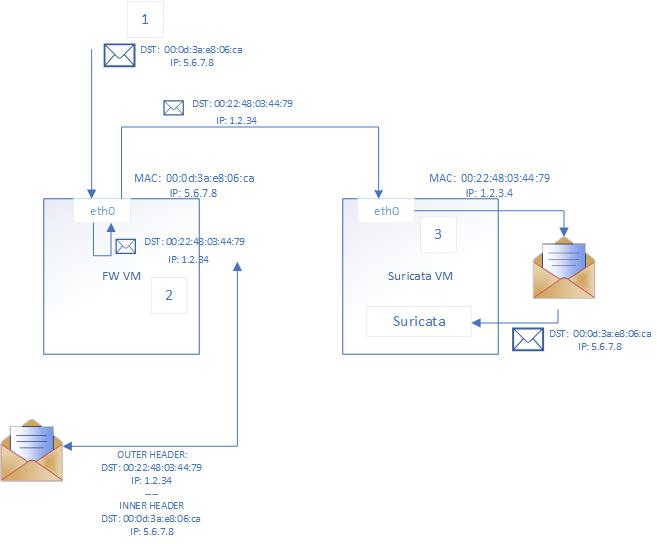
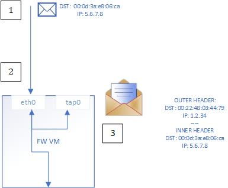
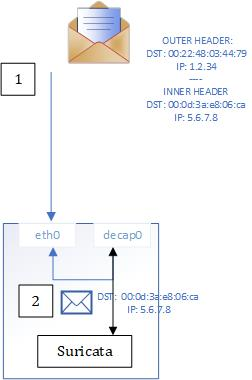

# fwtapper
A packet "tapping" (duplicating) service based on eBPF, written using Cilium.

This program can be used to offload network traffic to a remote destination for numerous reasons: Intrustion detection and prevention (using for example "Suricata"), Anomely detection, etc.
The benifit of offloading network traffic for high throughput, low latency services comes when the cost of offloading traffic is **lower** than the computation needed to be done "inline". Though, this requires extensive performance measurments.

## High level architecture:
The tapper has two ends - a `transmit` end which transmits **encapsulated packets** to a destination ip using a custom UDP header,
and a `recieve` end which recieves encapsulated packets and **decapsulates** them, in the following manner:
<p align="center">
  
</p>

The `recieve` end can recieve and process packets from multiple sources running the `transmit` end.

## fwtapper transmit
To run the transmit end, run the following command:
```
sudo ./fwtapper transmit --destination-ip 10.0.100.8 --destination-mac 00:0d:3a:e8:06:ca
```
The `fwtapper` program transmit architecture and flow is as following:

<p align="center">
  
</p>

## fwtapper recieve
To run the recieve end, use the following command:
```
sudo ./fwtapper recieve --source-ips "10.0.100.5,..."
```

The `fwtapper` program recieve architecture and flow is as following:

<p align="center">
  
</p>

## How to verify the program is loaded properly?
Use the following command: `ip link`, and find the added interface `egress-iface` listed.
To see the `bpf` filter added use the following: `sudo tc -s -d filter show dev eth0 ingress`.
